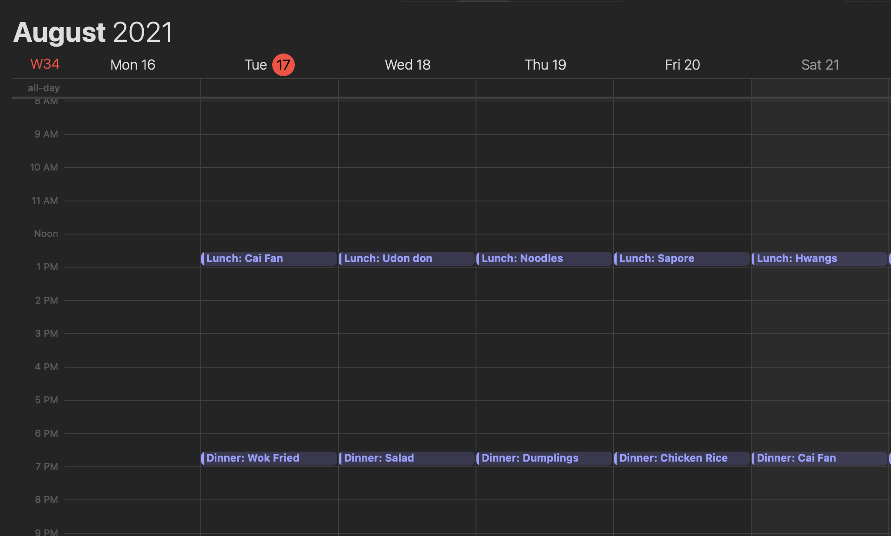

# MealPlanner
Script to generate .ics file that contains planned meals for the next N days based on a list of acceptable options

## How to use

1. `pip install arrow ics`
2. Modify acceptable food options in script, `python mealplan.py -h` to see options
3. Run and double click .ics file to import to calendar

## Result

